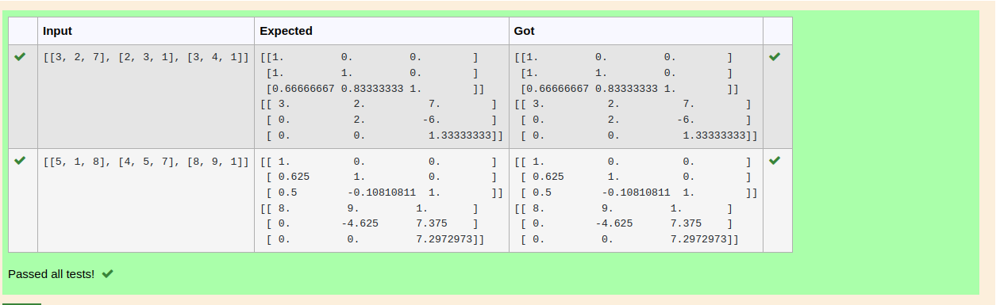

# LU Decomposition 

## AIM:
To write a program to find the LU Decomposition of a matrix.

## Equipments Required:
1. Hardware – PCs
2. Anaconda – Python 3.7 Installation / Moodle-Code Runner

## Algorithm
```
1.Import numpy
2.From scipy.linalg import lu ,lu_factor,lu_solve respectively
3.Get the input of matrix values from user using eval
4.Using P,L,U=lu(A) we can find L and U matrix . Using res=lu_factor(A) ,solution=lu_solve(res,B) we can find LU Decomposition of a matrix.
5.Print the respective outputs and end the program

## Program:
(i) To find the L and U matrix
'''Program to find L and U matrix using LU decomposition.
Developed by: dharmaraj S
RegisterNumber:22002459 
'''
import numpy as np
from scipy.linalg import lu
arr=eval(input())
A=np.array(arr)
P,L,U=lu(A)
print(L)
print(U)


(ii) To find the LU Decomposition of a matrix
'''Program to solve a matrix using LU decomposition.
Developed by:dharmaraj S 
RegisterNumber:22002459 
'''

# To print X matrix (solution to the equations)
import numpy as np
from scipy.linalg import lu_factor,lu_solve
A=np.array(eval(input()))
B=eval(input())
res=lu_factor(A)
solution=lu_solve(res,B)
print(solution)
```


## Output:



## Result:
Thus the program to find the LU Decomposition of a matrix is written and verified using python programming.

